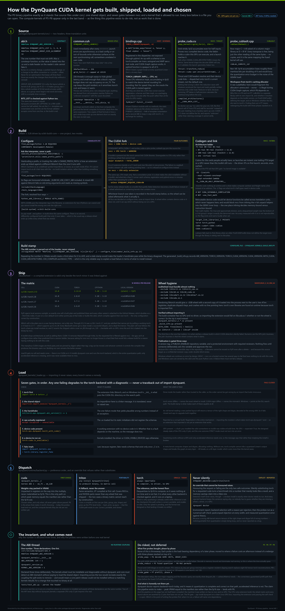

# DynQuant

**Mixed-precision LLM quantization that decides bit-widths from your fine-tune's own training dynamics.**

Most post-training quantizers see a finished model and have to guess which weights
matter. DynQuant watches the fine-tune you were going to run anyway, and lets the
optimizer tell it.

## Quick start

**1. Add one callback to the fine-tune.**

```python
from transformers import Trainer
from dynquant import DynQuantCallback

trainer = Trainer(model=model, ..., callbacks=[DynQuantCallback("stats/")])
trainer.train()
# stats/dynquant_stats.json        per-module signals
# stats/dynquant_moments.safetensors   per-channel second moments
```

`SFTTrainer` (TRL) takes the same callback; for a hand-written loop use
`with track_signals(model, out="stats/"):`. Under DDP / FSDP / DeepSpeed the
accumulators are reduced across ranks before either file is written.

**2. Read the allocation before you spend a GPU-hour on it.**

```bash
dynquant inspect ./merged --stats stats/ --moments stats/ \
         --target 3.25 --uniform 3 4 --save-map maps/
```

Prints role, parameters, sensitivity and assigned width per module, plus the three
things a width histogram cannot show: within-role concordance of width with score,
every floor the budget forced it to breach, and every module the signal never saw.
`--uniform` puts the control arm in the same table.

**3. Quantize.**

```bash
dynquant quantize ./merged --map maps/ -o ./q3
```

The reviewed map is the map that gets applied — no second allocation in between.

**4. Measure it, paired.**

```bash
dynquant eval ./merged --task casehold --out runs/bf16.json
dynquant eval ./q3     --task casehold --out runs/q3.json --compare runs/bf16.json
```

`--compare` runs a paired McNemar test and refuses to compare across a differing
task, split, shot count, seed or limit. For the memory figure rather than the
accuracy figure, `dynquant eval ./merged --map maps/` keeps the weights packed in
VRAM while it scores; `dynquant bench --model ./merged` reports what fraction of
the card's achievable bandwidth the packed GEMV reaches.

## The idea

What DynQuant asks the fine-tune for is the one quantity a bit allocator actually
needs: **how much does the loss rise if I quantize this module to `b` bits?**

Two per-channel second moments are accumulated during training — `E[x_c²]` over a
module's input channels and `E[δ_r²]` over its output-gradient channels. They are
vectors of length `in_features` and `out_features`, not matrices, so the whole
model's signal is a few MB, and they are sampled every 16th optimizer step rather
than every step. Combined with the *measured* quantization error of each candidate
width, they give a diagonal Gauss–Newton (empirical Fisher) estimate of the loss
increase:

```
ΔL_m(b)  ≈  Σ_rc  E[δ_r²] · E[x_c²] · (W − Q_b(W))²_rc
```

`Q_b` is the encoder that will actually run, at the clipping threshold its own
search actually picks, so `ΔL` is in loss units — per module, per width. Pricing a
bit is then a subtraction rather than a heuristic: `ΔL(3) − ΔL(4)` is what a fourth
bit buys. A greedy multiple-choice knapsack over {2, 3, 4, 8} spends the budget
where that difference is largest, subject to per-role floors (routers and MLA latent
projections never go low; norms stay fp16).

### Why not the published score

The research version ranked two signals and multiplied them —
`S_i = Rank(log(1 + Var_t‖∇W_i‖²)) × Rank(EMA‖X_i‖)`, a soft AND of "still moving"
and "load-bearing" — then assumed a universal `4^−bits` error curve to convert a
rank into the value of a width change. Both halves were checked against ground
truth: all 187 quantizable modules of a fine-tuned Qwen3.5-2B were quantized one at
a time to 3 bits and the true task-loss disturbance measured. Ranked *within* role —
the regime the allocator runs in, since role floors already separate roles from each
other:

| ordering | mean Spearman ρ | right sign in |
|---|---|---|
| `ΔL` above | **+0.521** | 11 / 12 roles |
| plasticity rank alone | +0.491 | 11 / 12 |
| rank product (published) | +0.231 | 9 / 12 |
| saliency rank alone | −0.301 | 2 / 12 |
| `ΔL` with `E[δ_r²]` dropped | −0.338 | 1 / 12 |

Activation RMS does not merely fail to help; it anti-correlates with disturbance in
10 of 12 roles, and multiplying it in drags a +0.491 signal down to +0.231. The
reason is visible once stated: a module with large activations has large *outputs*,
so the error it contributes is relative to those outputs and downstream
normalisation divides much of it back out. Saliency measures scale; the allocator
needs curvature. The last row is the honest control — what a calibration-free method
can compute — and it points the wrong way, which is why `--moments` is what turns on
the good estimator and plasticity ranks are only the fallback for modules whose
moments were never collected.

The rank product remains reachable (`ScoreConfig(combine="rank_product")`), because
reproducing the published numbers requires reproducing this too.

## Status

Early. The table below is the honest state of each phase. Each has a hard exit gate that
has to be measured on hardware before the phase is called done, and where a gate is only
partly met the table says so rather than rounding up.

| | Phase | State |
|---|---|---|
| P0 | Packaging, build system, backend dispatch, CLI, `dynquant doctor` | done; published to PyPI at 0.1.0, variant wheels on the GitHub release |
| P1 | On-disk formats: packed tensors, stats schema, role model | done |
| P2 | Training-time signal collection hook | done, GPU gate items open |
| P3 | Architecture-generic role classification | done |
| P4 | Scoring and budget allocation | done |
| P5 | Quantizer driver + MSE clip search (torch; CUDA deferred) | done |
| P6 | Decode GEMV kernels (2/3/4/8-bit) | done; bandwidth gate met at 8-bit only |
| P7 | Tensor-core prefill GEMM | |
| P8 | MoE grouped GEMM + CUDA Graphs | |
| P9 | Packed checkpoint writer + `from_pretrained` load path | |
| P10 | Eval, benchmarks, docs | partial: `eval` and `bench` ship, docs site does not |

1275 tests. 856 of them run anywhere — CPU only, no GPU, no download, no checkpoint
— and the remaining 419 need the compiled kernels on a CUDA device, where they pass.

Two of P2's gate items still need a multi-GPU box: tracker step-time overhead under
3% and a 128-expert MoE without a step-time cliff. The third — two-process DDP
parity — now runs; those tests existed but had never executed, because
`torch.multiprocessing`'s spawn pickling cannot resolve a target defined in a test
module under `--import-mode=importlib`. P5 shipped the torch encoder that the CUDA
path in the plan will have to match numerically; the fused Thrust/CUB kernel is not
written, so quantizing a 14B model has not been timed against the paper's
six-minute claim.

**What P0 "done" does and does not cover.** All three wheels build and install into
a clean venv on a CUDA box, `dynquant doctor` passes its numerical self-check there,
and the four commands above are the shipped CLI. The kernels wheel is repaired to
`manylinux_2_34_x86_64` — glibc 2.34 is the floor its symbols impose, so Ubuntu 22.04
and newer — and that repair is verified to be a pure retag: nothing vendored, the
`_C` extension byte-identical, torch and CUDA resolved from the already-loaded
process image rather than from a second copy inside the wheel.

Publishing is done as of 0.1.0, in the split shape that constraint forces. Twelve of
the thirteen binary builds are versioned `0.1.0+cu126torch26` and the like, and PEP
440 local versions cannot go to PyPI at all — so PyPI holds the pure-Python core plus
the one default combination (cu126 / torch 2.7, CPython 3.10–3.13, Linux x86_64), and
the [v0.1.0 release][v010] carries the rest and serves as the `find-links` variant
index. The plan's mkdocs site is still not written; this README and
[docs/format-spec.md](docs/format-spec.md) are the docs.

[v010]: https://github.com/kambojvikram/dynquant/releases/tag/v0.1.0

**What "done" means for P6, precisely.** The published research prototype dequantized
back to fp16 at load time — storage savings only, no VRAM reduction and no speedup.
P6 makes the packed weights stay packed, and on an A100 that is measured: resident
VRAM matches the manifest to 0.03% and is 4.8× below bf16, with accuracy bit-identical
to the simulated path. The GEMV in isolation is 1.09–2.56× bf16 across Qwen3.5-2B's
five shapes. But its **≥70%-of-achievable-bandwidth gate is met only at 8 bits** (98%);
4-bit reaches 67%, 3-bit 52%, 2-bit 36%, and what remains is instruction-issue bound
rather than bandwidth bound. Closing it is P7's tensor-core path, not more tuning.
Those percentages are against the denominator that run measured, 1630 GB/s; the same
card has measured up to 1796 GB/s on another day, which moves every percentage by a
tenth and none of the conclusions. That variance is the reason `dynquant bench`
measures the denominator per run instead of hardcoding one.
Separately, faster weight streaming does not make *this* model decode faster — it decodes at
**0.90×** bf16 at batch 1. Profiling both arms through one script shows the kernel working
and being outweighed: in-model matmul time is 1.42× faster packed, but matmul is only 12% of
a step that is ~2000 launches and ~70% idle, and the host-side cost of dispatching 187 packed
modules from Python exceeds the 3.5% of the step that 1.42× buys back. That is what P8's CUDA
Graphs remove. `experiments/qwen35_2b/RESULTS.md` reports all of it, including the arms that
lost and one figure it previously got wrong.

P7–P8 have not landed: prefill still goes through dequantize-then-GEMM, and so does
decode above `gemv_max_rows() == 8`.

**What P9 not being done means for `quantize`.** There is no packed-checkpoint
writer yet, so `dynquant quantize -o` writes an ordinary `transformers` folder whose
every value has been encoded to its allocated width and decoded back. That
reconstructs exactly the values a packed checkpoint would hold, so accuracy measured
on it is real; its *size* is the compute dtype's size, and the command prints the
packed size beside it on every run rather than leaving the two to be confused.
`dynquant eval --map` is the path on which the weights really are packed in VRAM,
and it is the only one from which a memory or speed figure means anything. Nothing
in this repository reports them from the other.

## Install

On Linux x86_64 with CPython 3.10–3.13, **pin torch when installing 0.1.0**:

```bash
pip install dynquant 'torch==2.7.*'               # core + kernels
```

The pin is doing real work and leaving it out is the difference between having the
kernels and not. 0.1.0's kernels wheel declares an open `torch>=2.4` while the binary
is linked against torch 2.7.1's C++ ABI, so a bare `pip install dynquant` resolves
torch 2.13 next to it, the extension fails an undefined-symbol import, and DynQuant
falls back to the torch backend — `pip` reporting success the whole way. Run
`dynquant doctor`; it says which backend it actually got. Fixed at source for 0.1.1,
where each wheel pins the minor it was built against; see
[CHANGELOG.md](CHANGELOG.md#known-issues-in-010).

There is one wheel on PyPI — the cu126 / torch 2.7 build. For other combinations the
[v0.1.0 release][v010] is a `--find-links` variant index:

```bash
pip install 'torch==2.8.*' && pip install dynquant-kernels==0.1.0+cu128torch28 \
  --find-links https://github.com/kambojvikram/dynquant/releases/expanded_assets/v0.1.0
```

Anywhere else — Windows, macOS, CPU-only, ARM, glibc older than 2.34 — `dynquant-core`
installs on its own and runs on the torch backend, no compiler needed. Building the
kernels there needs nvcc and cmake >= 3.26. From a checkout:

```bash
pip install packages/dynquant-core                # pure Python: allocate and quantize anywhere
pip install --no-build-isolation packages/dynquant-kernels   # needs nvcc + cmake >= 3.26
pip install 'packages/dynquant-core[train]'       # + transformers, peft, trl, datasets
```

Then, always, before trusting a number out of it:

```bash
dynquant doctor
```

It reports the selected backend and why the others were rejected, then runs a
numerical self-check. It exits non-zero if anything found would make results
untrustworthy — so it belongs in your Dockerfile.

## Layout

```
packages/dynquant-core/      import `dynquant`          pure Python, installs anywhere
packages/dynquant-kernels/   import `dynquant_kernels`  CUDA C++, one wheel per variant
packages/dynquant/           meta-distribution         what `pip install dynquant` resolves
tests/                       runs against a source checkout, no install step needed
```

The kernels wheel is deliberately a separate top-level import name rather than
`dynquant.kernels`: two distributions sharing one import namespace turns an
interrupted upgrade into mismatched halves with nothing to detect it.

## How the CUDA kernel gets built, shipped, loaded and chosen

[](docs/images/cuda-kernel-architecture.png)

Every box in it is a file under [packages/dynquant-kernels/](packages/dynquant-kernels/),
and the compute kernels of P5–P8 appear only in the last band — as what the P0
probes de-risk, not as work that is done.

The picture is generated by
[docs/diagrams/kernel_architecture.py](docs/diagrams/kernel_architecture.py), for
the same reason every number in [docs/format-spec.md](docs/format-spec.md) is
generated: a hand-drawn architecture diagram starts as documentation and ends as
folklore. Change the build, then regenerate:

```bash
python docs/diagrams/kernel_architecture.py
```

## Development

```bash
pip install -e "packages/dynquant-core[dev]"
pytest                                        # CPU only, no GPU needed
pip install --no-build-isolation -e packages/dynquant-kernels   # needs nvcc + cmake
```

`--no-build-isolation` is not optional for a local kernels build: in an isolated
environment pip resolves the newest torch, and an extension linked against a
different libtorch than the one you run fails to import.

## License

Apache-2.0. See [LICENSE](LICENSE).
